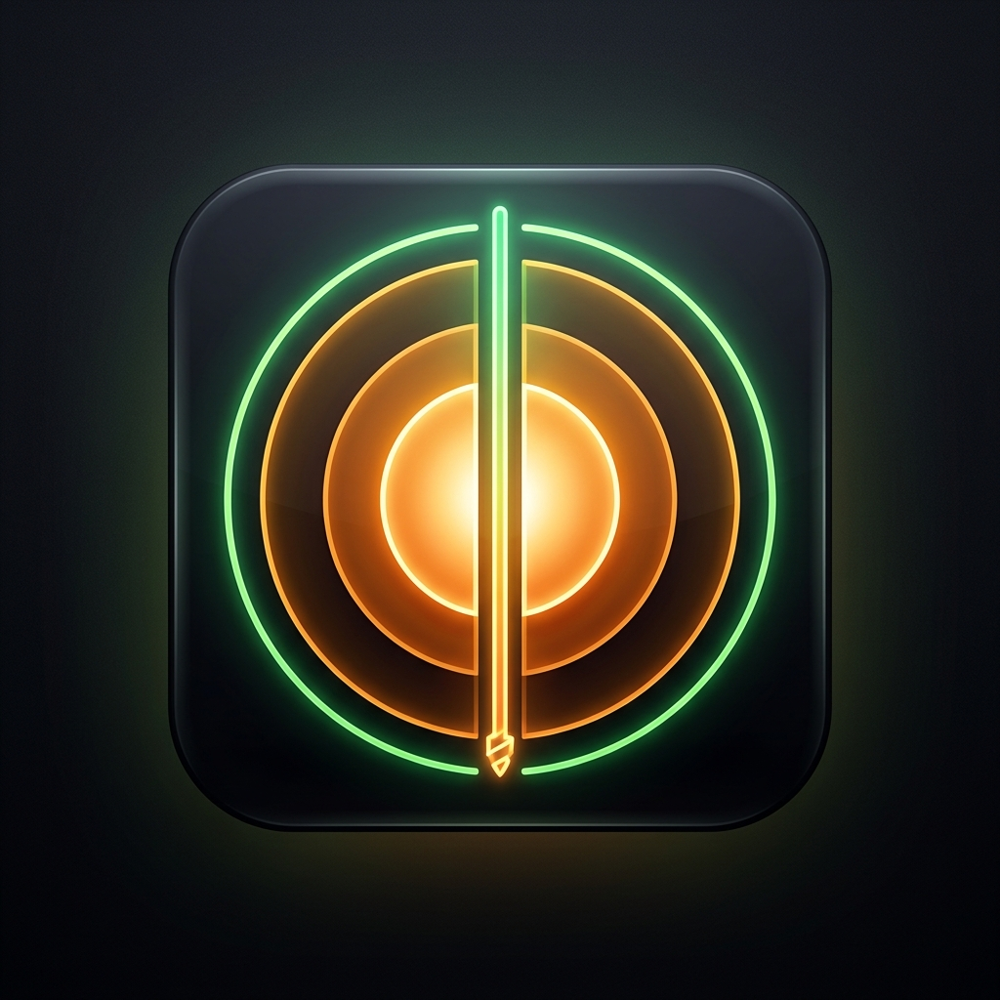

# DEPTH. (Planetary Drilling Simulator)

> [🇰🇷 한국어 버전으로 보기 (Korean Version)](README_KO.md)

**DEPTH.** is an immersive, idle-clicker mobile game where players tap to drill through the Earth's geological layers. Starting from the crust, players descend 6,371 km through the mantle, outer core, and inner core, managing drill temperature and discovering rare minerals along the way.

Upon reaching the core, the game calculates and visualizes the exact antipodal point of the player's real-world starting location using GPS coordinates, issuing a personalized completion certificate.

## 🌍 Features

- **Real-Time Drilling:** Tap to drill through Earth's layers. Manage drill temperature and pressure.
- **36 Collectible Minerals:** Discover scientifically accurate minerals specific to each geological layer (from Quartz to Perovskite).
- **Upgrade System:** Upgrade motor power, cooling system, drill bit, and rotation speed.
- **Mineral Exchange:** Synthesize 5 common minerals into 1 rare mineral of the next tier.
- **Antipode Discovery:** Real-world GPS integration to calculate your exact antipode on the other side of the planet.
- **Completion Certificate:** High-quality downloadable certificate showcasing your departure, arrival, and journey stats.

## 📄 Privacy & Support

- This app does **not** collect, store, or transmit any personal data. GPS data is only used locally for antipode calculation.
- For support or bug reports, please contact us at: `woojinim64@gmail.com`

---
*© 2026 RAKKUNN — ALL RIGHTS RESERVED*
