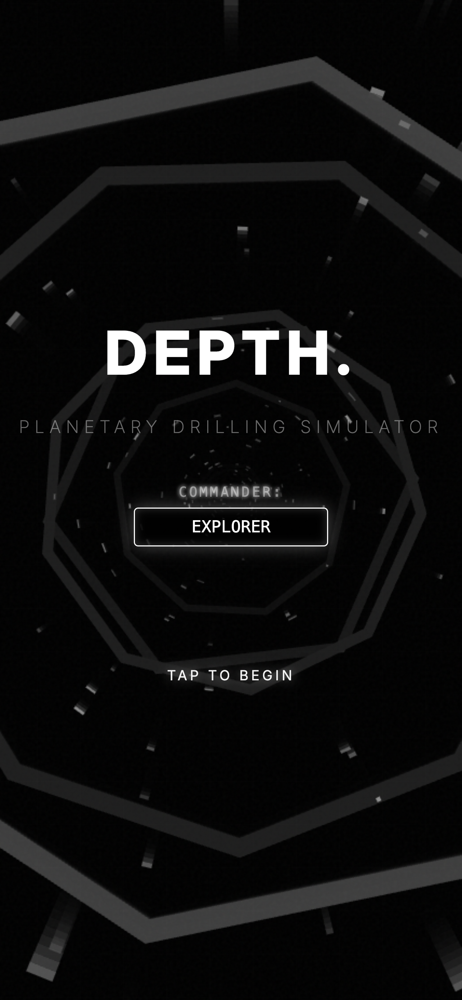

# DEPTH. (Planetary Drilling Simulator)

*(한국어 설명은 아래에 있습니다 / Korean description below)*

## 🇬🇧 English

**DEPTH.** is an immersive, idle-clicker mobile game where players tap to drill through the Earth's geological layers. Starting from the crust, players descend 6,371 km through the mantle, outer core, and inner core, managing drill temperature and discovering rare minerals along the way.

Upon reaching the core, the game calculates and visualizes the exact antipodal point of the player's real-world starting location using GPS coordinates, issuing a personalized completion certificate.

### 🌍 Features

- **Real-Time Drilling:** Tap to drill through Earth's layers. Manage drill temperature and pressure.
- **36 Collectible Minerals:** Discover scientifically accurate minerals specific to each geological layer (from Quartz to Perovskite).
- **Upgrade System:** Upgrade motor power, cooling system, drill bit, and rotation speed.
- **Mineral Exchange:** Synthesize 5 common minerals into 1 rare mineral of the next tier.
- **Antipode Discovery:** Real-world GPS integration to calculate your exact antipode on the other side of the planet.
- **Completion Certificate:** High-quality downloadable certificate showcasing your departure, arrival, and journey stats.

### 📄 Privacy & Support
- This app does **not** collect or transmit any personal data. GPS data is only used locally for antipode calculation.
- For support or bug reports, please contact us at: `woojinim64@gmail.com`

---

## 🇰🇷 한국어

**DEPTH.**는 플레이어가 화면을 탭하여 지구의 지질학적 층을 뚫고 내려가는 몰입형 방치형 모바일 게임입니다. 지각에서 시작하여 맨틀, 외핵, 내핵을 거쳐 6,371km를 하강하며 드릴의 온도를 관리하고 희귀 광물들을 발견하게 됩니다.

지구 중심을 돌파하면 플레이어의 실제 GPS 출발 위치를 기반으로 정확한 대척점(Antipode, 지구 반대편 위치)을 계산하고 시각화하여 개인 맞춤형 완료 인증서를 발급합니다.

### 🌍 주요 기능

- **실시간 드릴링:** 탭하여 지구의 층을 뚫고 내려갑니다. 드릴의 온도와 압력을 관리하세요.
- **36종의 수집형 광물:** 각 지질학적 층에 위치한 과학적으로 정확한 광물들을 발견하세요 (석영부터 페로브스카이트까지).
- **업그레이드 시스템:** 모터 출력, 냉각 시스템, 드릴 비트 및 회전 속도를 업그레이드하세요.
- **광물 교환:** 5개의 일반 광물을 다음 티어의 희귀 광물 1개로 합성하세요.
- **대척점 발견:** 실제 GPS 연동을 통해 지구 반대편의 정확한 대척점 위치를 계산합니다.
- **완료 인증서:** 출발지, 도착지, 여정 통계가 표시된 고품질 다운로드용 인증서를 제공합니다.

### 📄 개인정보 보호 및 고객지원
- 이 앱은 어떠한 개인 데이터도 수집하거나 서버로 전송하지 않습니다. GPS 데이터는 대척점 계산을 위해 기기 내에서만 일회성으로 사용됩니다.
- 지원이 필요하거나 버그를 신고하시려면 다음 이메일로 연락해 주세요: `woojinim64@gmail.com`

---
*© 2026 RAKKUNN — ALL RIGHTS RESERVED*
